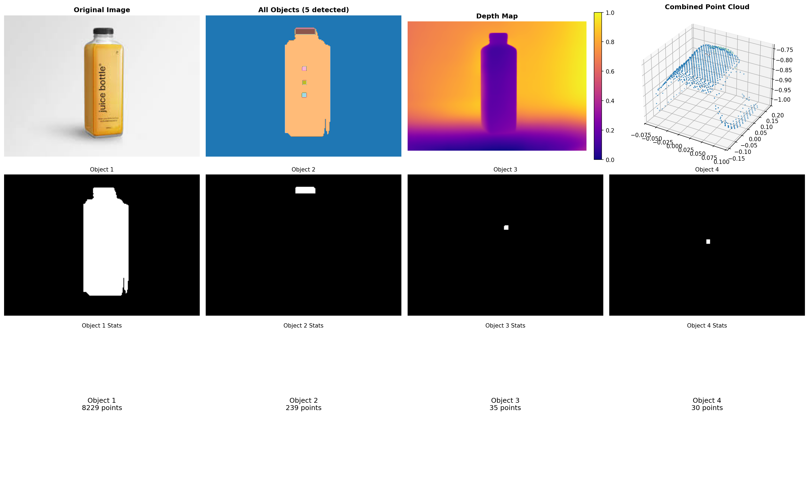

# Multi-Object 3D Pipeline 

A complete computer vision pipeline that performs object segmentation, depth estimation, and 3D point cloud generation for multiple objects in a single image.

## 🎯 Project Overview

This project demonstrates a complete pipeline that meets the IITISOC selection criteria:

1. **FastSAM Inference** - Advanced object segmentation using FastSAM
2. **Depth Pro Estimation** - High-quality depth map generation for RGBD images  
3. **Multi-Object Point Clouds** - Individual 3D point cloud generation for each detected object

## 🎬 Demo Video


**Watch the complete pipeline in action:**

[

*Click the image above to watch the demo video showcasing:*
- FastSAM object segmentation in real-time
- Depth Pro depth estimation visualization
- Multi-object point cloud generation
- Interactive 3D visualization


## ✨ Features

- **Object Segmentation**: Detect and segment multiple objects using FastSAM
- **Depth Estimation**: Generate accurate depth maps using Apple's Depth Pro model
- **3D Reconstruction**: Create individual point clouds for each segmented object
- **Interactive Visualization**: View point clouds individually or combined
- **Comprehensive Output**: Save all results including masks, depth maps, and point clouds
- **Robust Error Handling**: Graceful failure handling with detailed logging

## 🚀 Key Capabilities

- Processes any RGB image input
- Segments multiple objects automatically
- Generates metric depth with absolute scale
- Creates separate point clouds for each object
- Color-codes objects for easy identification
- Saves results in standard formats (PLY, NPY, PNG)

## 📋 Requirements

### System Requirements
- **OS**: Windows 10/11, Linux, or macOS
- **RAM**: 8GB+ recommended
- **GPU**: NVIDIA GPU with CUDA support (optional but recommended)
- **Storage**: 5GB+ free space for models and outputs

### Software Requirements
- Python 3.9
- CUDA Toolkit 12.8+ (for GPU acceleration)
- Conda or Miniconda

## 🛠️ Installation

### Step 1: Create Conda Environment

```
# Create a new conda environment with Python 3.9
conda create --name pose_estimation python=3.9

# Activate the environment
conda activate pose_estimation
```

### Step 2: Install Dependencies

```
# Install core packages
pip install ultralytics transformers open3d torch torchvision

# Install additional packages
pip install matplotlib pillow "numpy=2.1.0
torchvision>=0.15.0
transformers>=4.25.0
ultralytics>=8.0.0
open3d>=0.18.0
pillow>=9.0.0
opencv-python>=4.5.0
matplotlib>=3.5.0
numpy=2.23.0
psutil
```

or simply install with:
```
pip install -r requirements.txt
```

## 📁 Project Structure

```
project/
│
├── complete_pipeline.py      # Main pipeline code
├── requirements.txt          # Package dependencies
├── README.md                # This file
├── images/                  # Folder containing input images
│   ├── demo_image1.jpg      # Sample input image 1
│   ├── demo_image2.jpg      # Sample input image 2
│   ├── demo_image3.jpg      # Sample input image 3
│   └── your_image.jpg       # Your input image(s)
│
└── pipeline_output/         # Generated outputs
    ├── multi_object_pipeline_results.png
    ├── combined_point_cloud.ply
    ├── object_1_point_cloud.ply
    ├── object_2_point_cloud.ply
    ├── depth_map.npy
    └── segmentation_masks.npy
```

## 🎮 Usage

### Step 1: Prepare Input Images

```
# Create images directory
mkdir images

# Place your images in the images folder
# Supported formats: .jpg, .jpeg, .png, .bmp
```

### Step 2: Update Image Path

**Edit the image path in `complete_pipeline.py`:**
```
# Update this line in the main execution block
image_path = "images/your_image.jpg"  # Path to your image in images folder
```

### Step 3: Run the Pipeline

```
# Activate conda environment
conda activate pose_estimation

# Run the pipeline
python complete_pipeline.py
```

### Sample Code Usage

```
from complete_pipeline import CompletePipeline

# Initialize pipeline
pipeline = CompletePipeline()

# Run on your image (from images folder)
results = pipeline.run_complete_pipeline("images/your_image.jpg")

# Check results
if results:
    print(f"✅ Detected {len(results['masks'])} objects")
    print(f"✅ Generated {len(results['object_point_clouds'])} point clouds")
    print(f"✅ Output saved to: {results['output_dir']}")
```

### Batch Processing Multiple Images

```
import os
from complete_pipeline import CompletePipeline

# Initialize pipeline once
pipeline = CompletePipeline()

# Process all images in the images folder
image_folder = "images"
for image_file in os.listdir(image_folder):
    if image_file.lower().endswith(('.jpg', '.jpeg', '.png', '.bmp')):
        image_path = os.path.join(image_folder, image_file)
        print(f"\n🔄 Processing: {image_path}")
        
        results = pipeline.run_complete_pipeline(image_path)
        if results:
            print(f"✅ Completed: {image_file}")
        else:
            print(f"❌ Failed: {image_file}")
```

## 📊 Output Files

| File | Description |
|------|-------------|
| `multi_object_pipeline_results.png` | Complete visualization with all results |
| `combined_point_cloud.ply` | All objects in one colored point cloud |
| `object_N_point_cloud.ply` | Individual point cloud for object N |
| `depth_map.npy` | Raw depth data from Depth Pro |
| `segmentation_masks.npy` | Segmentation masks from FastSAM |

## 🎯 Demonstrations

This project demonstrates:

✅ **FastSAM Inference**: Automatic object segmentation with mask generation  
✅ **RGBD Image Display**: High-quality depth estimation and visualization  
✅ **Point Cloud Generation**: 3D reconstruction for each detected object  

## 📸 Sample Results

### Input and Output Examples

| Original Image | Segmentation  and Depth Map | Point Cloud
|---------------|-------------|-------------|
|  |  |

*Sample results showing the complete pipeline workflow*

## 🔧 Troubleshooting

### Common Issues

**1. Import Errors**
```
# If you get ultralytics import errors
pip uninstall ultralytics
pip install ultralytics

# Check for conflicting files
ls *.py | grep ultralytics  # Remove any files named ultralytics.py
```

**2. Image Path Issues**
```
# Ensure images folder exists and contains your image
ls images/
# Should show your image files
```

**3. GPU Issues**
```
# Force CPU usage if GPU causes problems
device = "cpu"  # Change in the pipeline initialization
```

**4. Memory Issues**
```
# Reduce image size for processing
imgsz=640  # Instead of 1024 in FastSAM parameters
```

**5. Point Cloud Issues**
- Ensure image path points to `images/` folder
- Check that objects are detected (segmentation step)
- Verify depth estimation produces reasonable values

### Debug Mode

Enable verbose output:
```
pipeline = CompletePipeline()
results = pipeline.run_complete_pipeline("images/your_image.jpg", verbose=True)
```


## 📚 Dependencies Explanation

| Package | Purpose |
|---------|---------|
| `ultralytics` | FastSAM model for object segmentation |
| `transformers` | Depth Pro model for depth estimation |
| `open3d` | 3D point cloud processing and visualization |
| `torch` | Deep learning framework |
| `matplotlib` | Plotting and visualization |
| `pillow` | Image processing |
| `opencv-python` | Computer vision operations |

## 🚧 System Requirements

### Minimum
- **CPU**: Intel i5 or AMD equivalent
- **RAM**: 8GB
- **Storage**: 5GB free space
- **Python**: 3.9+

### Recommended
- **CPU**: Intel i7 or AMD equivalent
- **RAM**: 16GB+
- **GPU**: NVIDIA GTX 1660 or better
- **Storage**: 10GB+ free space
- **CUDA**: 11.8 or 12.x

## 🏆 Performance

- **Processing time**: 10-30 seconds per image (GPU)
- **Accuracy**: State-of-the-art segmentation and depth estimation
- **Resolution**: Supports up to 4K images
- **Objects**: Can handle 10+ objects per image

## 📧 Support

If you encounter issues:

1. Check the troubleshooting section above
2. Verify all dependencies are installed correctly
3. Ensure your image is in the `images/` folder
4. Check that your GPU drivers are up to date (for GPU acceleration)

## 🎉 Success Indicators

Pipeline completed successfully when you see:
```
🎉 MULTI-OBJECT PIPELINE COMPLETED!
   1. FastSAM Segmentation: X objects detected
   2. RGBD Image: ✅ Generated with Depth Pro
   3. Point Clouds: ✅ X individual + 1 combined
```

## 📜 License

This project is created for IITISOC selection demonstration purposes.

---

**Ready to run? Follow the installation steps, place your images in the `images/` folder, and execute the pipeline!** 🚀

